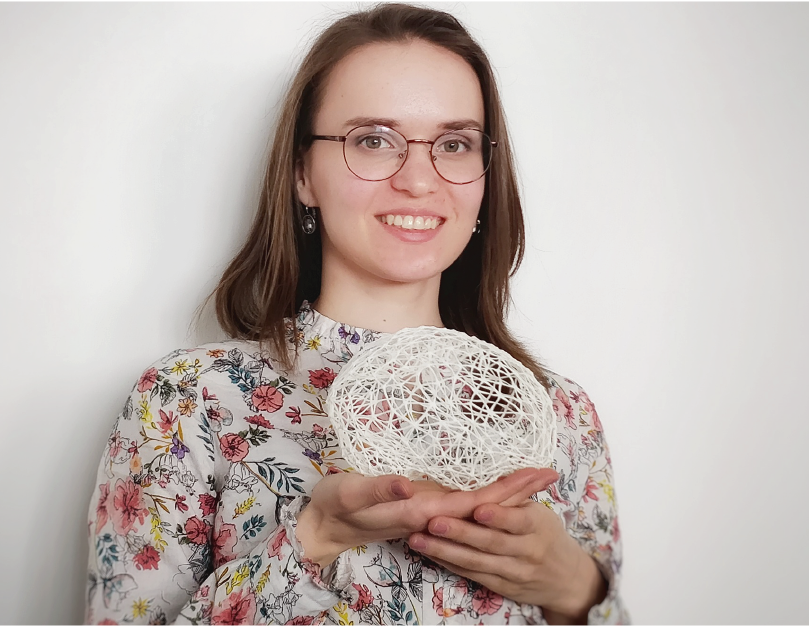

---
hide:
    - navigation
---

 

I'm a cognitive neuroscientist. 
I'm currently a postdoc at [the Adaptive Systems Group](https://adapt.informatik.hu-berlin.de/index.html) (PI: Prof. Dr. Verena Hafner) at the Humboldt-Universität zu Berlin. I'm part of the [MetaTool project](https://www.metatool-project.eu).

Previously, I was a PhD student at [the MetaMotorLab](https://metamotorlab.filevich.com) at at the Humboldt-Universität zu Berlin. 
